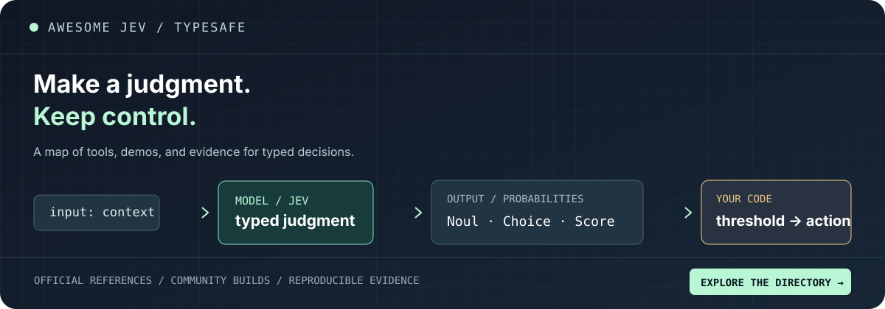

# Awesome Jev / TypeSafe

<!-- ALL-CONTRIBUTORS-BADGE:START - Do not remove or modify this section -->

<!-- ALL-CONTRIBUTORS-BADGE:END -->

**The field guide to typed decisions.**

Official docs, working integrations, independent experiments, and the builders pushing Jev into new territory. Jev turns context into a probability, a choice, or a score; your code owns the threshold and the action.

> **One call, three typed answers.** In [TypeSafe's documented support-ticket example](https://docs.typesafe.ai/introduction/quickstart), Jev chooses the technical team (0.85 probability), scores frustration at level 1 on a 0–2 rubric, and gives urgency a 1.0 Noul probability. The example response is from `jev-1.13.0`; application code still decides when to route or escalate.

| I want to… | Go here |
| :--- | :--- |
| Understand the idea in 2 minutes | [The introduction](https://docs.typesafe.ai/introduction) and [the three primitives](https://docs.typesafe.ai/primitives) |
| Make my first typed call | [Quick start](https://docs.typesafe.ai/introduction/quickstart) and [official SDKs](#sdks-and-developer-tools) |
| See it work live | [Typewriter's 16 judgments](https://typesafe-demo.val.run/) or [Jevtown's simulated audience](https://jevtown.ivanhabor.com/); then browse [all community projects](#community-projects) |
| Test the claims | [Independent evaluations](#evaluations-and-independent-research) and [TypeSafe's own evals](https://evals.typesafe.ai/) |

**[Explore the searchable web directory →](https://abdelstark.github.io/awesome-typesafe-jev/)** · **[Download the JSON directory](resources.json)** · **[Suggest a resource](https://github.com/AbdelStark/awesome-typesafe-jev/blob/main/CONTRIBUTING.md)** · **[Join the builder community](https://discord.gg/typesafe)**

**Independent community project.** This repository is not affiliated with or endorsed by TypeSafe AI. Community entries are labeled by section; inclusion is not a claim that TypeSafe has reviewed or approved them.

Last updated: 2026-09-21. Links and project descriptions change; please [report a stale entry](https://github.com/AbdelStark/awesome-typesafe-jev/issues/new?template=add-resource.yml).

## Contents

- [Start here](#start-here)
  - [Before you trust a decision](#before-you-trust-a-decision)
- [Official resources](#official-resources)
  - [Product and documentation](#product-and-documentation)
  - [SDKs and developer tools](#sdks-and-developer-tools)
  - [Concepts, patterns, and cookbooks](#concepts-patterns-and-cookbooks)
  - [Research and writing](#research-and-writing)
  - [Community and updates](#community-and-updates)
- [Community projects](#community-projects)
  - [Client libraries and integrations](#client-libraries-and-integrations)
  - [Agent and developer tooling](#agent-and-developer-tooling)
  - [Browser agents](#browser-agents)
  - [Finance and trading](#finance-and-trading)
  - [Games, robotics, and interactive demos](#games-robotics-and-interactive-demos)
  - [Evaluations and independent research](#evaluations-and-independent-research)
  - [Showcases and field notes](#showcases-and-field-notes)
- [Contributing](#contributing)
- [Contributors](#contributors)

## Start here

- [Introduction](https://docs.typesafe.ai/introduction) — What Jev is, how System One models differ from text-generation models, and the Choice, Score, and Noul primitives.
- [Quick start](https://docs.typesafe.ai/introduction/quickstart) — The shortest path from an API key to a typed decision in Python or JavaScript.
- [How to build with TypeSafe](https://docs.typesafe.ai/concepts/how-to-build-with-system-one) — Design guidance for decomposing a workflow into narrow judgments while keeping policy and side effects in code.
- [TypeSafe Console](https://console.typesafe.ai/) — Create keys and inspect live Jev requests.

One state can answer several focused questions in the same request. Pick the answer shape your code can use directly:

| Question shape | Use it for | What comes back |
| :--- | :--- | :--- |
| **Noul** | A clear yes/no claim, such as “Does this message request a refund?” | A number from 0 to 1: the probability of yes. |
| **Choice** | Selecting from named options, such as billing, technical, or sales. | The selected option, a probability for every option, and confidence. |
| **Score** | An ordered rubric, such as calm, concerned, or angry. | A position on your rubric, probabilities over its levels, and confidence. |

Ask independent questions together. Set thresholds, fallback behavior, and side effects in application code.

### Before you trust a decision

- **Give uncertain cases somewhere to go.** In one [KoBBQ calibration audit](https://github.com/jujumilk3/jev-calibration-audit/blob/main/FINDINGS.md), removing the “unknown” Choice option forced answers to unanswerable items. Include a no-match or review path when the task allows ambiguity.
- **Measure thresholds on your own labelled data.** [Janus](https://github.com/FirasSX914/Janus/blob/main/RESEARCH.md) found that a routing threshold useful on one dataset did not transfer to another; it ships no default threshold.
- **Test ranking as ranking.** An [independent ordering study](https://github.com/yodablocks/jev-orderby-bench/blob/main/README.md) passed its topic-membership checks and failed several product-relevance checks. Classification accuracy alone does not establish that `ORDER BY` on a probability is useful.
- **Audit the policy around the model.** In one [agent-action gate evaluation](https://github.com/ghubnab99/jev-enterprise-decision-fabric/blob/main/docs/evaluations/agent-action-gate-v1.md), the largest error source was the application’s own mapping from answers to actions. Keep permissions, thresholds, and side effects explicit in code.

These studies use particular tasks, datasets, and model versions. Treat their results as test designs for your workload, not universal guarantees.

## Official resources

### Product and documentation

- [TypeSafe AI](https://typesafe.ai/) — Official product site for System One models and Jev.
- [Documentation](https://docs.typesafe.ai/) — Guides, SDK references, patterns, cookbooks, and the HTTP API.
- [HTTP API reference](https://docs.typesafe.ai/api) — Request and response contract for direct API integrations.
- [Interactive demos](https://docs.typesafe.ai/demos) — Official hands-on examples, including the smart-home assistant.
- [Workflow evals](https://evals.typesafe.ai/) — TypeSafe's published workflows, model comparisons, methodology, and example queries.

### SDKs and developer tools

- [JavaScript SDK](https://github.com/typesafe-ai/typesafe-sdk-js) — Official JavaScript and TypeScript client with inferred answer types.
- [Python SDK](https://github.com/typesafe-ai/typesafe-sdk-python) — Official synchronous and asynchronous Python client.
- [System One Adapter](https://github.com/typesafe-ai/system-one-adapter-python) — Drop-in Python adapter for running the same typed interface over OpenAI, Anthropic, and OpenAI-compatible LLM APIs.
- [TypeSafe Agent Skills](https://github.com/typesafe-ai/skills) — Official agent skill for designing TypeSafe workflows from Claude Code, Codex, and other skill-compatible agents.
- [TypeSafe GitHub organization](https://github.com/typesafe-ai) — Source repositories maintained by TypeSafe.

### Concepts, patterns, and cookbooks

- [Primitives](https://docs.typesafe.ai/primitives) — Choice, Score, and Noul, including their result shapes and when to use each one.
- [Confidence](https://docs.typesafe.ai/confidence) — How confidence differs from answer probability and how to use it as an architectural control.
- [Patterns](https://docs.typesafe.ai/patterns) — Confidence-gated routing, composite scoring, speculative fan-out, and intent routing.
- [Example use cases](https://docs.typesafe.ai/concepts/use-case-map) — A map from real-world workflows to typed judgments.
- [Cookbooks](https://docs.typesafe.ai/cookbooks/parallel_questions) — Reproducible implementations for parallel questions, reranking, semantic search, guardrails, extraction, classification, and more.
- [Agent skill guide](https://docs.typesafe.ai/agent-skill) — Installation and usage instructions for the official TypeSafe skill.

### Research and writing

- [Introducing System One Models & Jev](https://typesafe.ai/blog/introducing-system-one-models-and-jev) — Launch post, product thesis, published results, and explicit limitations.
- [Manifesto](https://typesafe.ai/manifesto) — TypeSafe's case for machine-native intelligence built for software rather than conversation.
- [The Bitterest Lesson](https://typesafe.ai/blog/bitterest-lesson) — Why optimizing the wrong task can dominate gains from scale.
- [AI: too good to be true, too bad to be useful](https://typesafe.ai/blog/ai-too-good-to-be-true-too-bad-to-be-useful-typesafe-ai) — The argument for moving beyond preference-optimized chat models in automation.

### Community and updates

- [Discord](https://discord.gg/typesafe) — Official community server for builders, support, and discussion.
- [Show and Tell](https://discord.com/channels/1483217544214085663/1483217545040232493) — Builder demos and work in progress; joining the Discord server is required.
- [X](https://x.com/typesafeai) — Product and research updates.
- [LinkedIn](https://www.linkedin.com/company/typesafe-ai/) — Company announcements and hiring updates.

## Community projects

Community projects are independent unless their repository says otherwise. Read the code, licenses, data-handling notes, and evaluation caveats before using them in a consequential system.

### Client libraries and integrations

- [Advocaat](https://github.com/pithings/advocaat) — Small TypeScript client with ergonomic tagged helpers for typed chances, choices, and scores.
- [BTK audit studies](https://boringtoolskit.com/blog/seo-audit-cost-2026/) — Production SEO studies driven by Jev striking-distance triage: 1,204 pages judged per run, 4,816 typed judgments in under 3 minutes, $0.0048 per 12-query batch (jev-1.13.0).
- [DocJev](https://github.com/jerryjliu/docjev) — Python library, CLI, and local app that uses LiteParse for document text and Jev to classify PDF, DOCX, and PPTX files or split mixed packets; optional LlamaParse provides cloud OCR. Its published 40-document, eight-packet comparison includes raw results but no human label review; normalized page text goes to the decision provider.
- [HA-Jev](https://github.com/AboveColin/HA-Jev) — Home Assistant integration that turns typed questions about entity state into sensors and automation actions, with entities reporting daily calls, tokens, and estimated cost and a token budget that halts evaluation; answers carry no explanation, so it is not suitable for safety decisions.
- [Hunch](https://github.com/carldaws/hunch) — Ruby gem that turns judgment calls into control flow: `if Hunch.likely?("fraudulent", given: order)` branches on a typed Jev answer, with `pick` for Choice, `rate` for Score, and graded predicates from `possibly?` to `definitely?`; not affiliated with TypeSafe AI.
- [jev-acp](https://github.com/formulahendry/jev-acp) — Standalone ACP agent for Jev Choice, Score, and Noul decisions, with guided input, reusable templates, and probability displays; requires a TypeSafe API key and sends decision inputs to TypeSafe.
- [jevql](https://github.com/kylemclaren/jevql) — psql-shaped CLI and Go/TypeScript/Python SDKs that let you write `WHERE jev(alias, 'condition')`, `jev_prob`, `jev_choice`, and `jev_score` against a vanilla Postgres with no extension: it runs the plain SQL on the server, judges the surviving rows with Jev in batches (cached in local SQLite), and applies filter, sort, and group in the client; every row that survives the SQL filters is sent to TypeSafe and judged, so put cheap predicates in SQL first.
- [json-render](https://github.com/vercel-labs/json-render) — Generative UI framework with an experimental Jev composer that selects components and layout from application-supplied candidates through Vercel AI Gateway. The [Jev API](https://json-render.dev/docs/jev) is unreleased and requires a source build; application code owns components, actions, and side effects.
- [LlamaIndex Jev](https://github.com/WiktorB2004/llama-index-jev) — Unofficial LlamaIndex reranker and query-engine selector on the official Python SDK: Jev scores retrieved passages and chooses which tool handles a query; score mode is a 0–3 rubric, not cosine similarity.
- [OCaml SDK](https://github.com/jonesmelton/verdict) — Unofficial eio-based client.
- [pi-typesafe](https://github.com/DevMortimer/pi-typesafe) — Pi extension and library that gives the agent and other extensions one consented, key-managed TypeSafe client with a batched `typesafe_evaluate` tool and offline-testable transport; requests are billable and opt-in per user.
- [RubyLLM TypeSafe](https://github.com/kieranklaassen/ruby_llm-typesafe) — TypeSafe provider for RubyLLM 2 with offline model metadata and typed responses.
- [s1-rs](https://github.com/AbdelStark/s1-rs) — Rust derive layer for Choice, Score, Noul, typed question sets, confidence gates, and network-free testing.
- [scala-jev-sdk](https://github.com/ticofab/scala-jev-sdk) — Community Scala 3 client for TypeSafe's System One API with typed Noul, Choice, and Score questions whose answers are retrieved with the question value itself, no effect system of its own so the same code runs on any sttp backend from `Future` to blocking, cats-effect, or ZIO, retries that honour `Retry-After`, and local validation that rejects a malformed question set before it costs a round trip; every call returns an `Either` rather than throwing, effects other than `Future` and the blocking `Identity` must supply a one-line sleeper for the retry timer, Scala 2.13 is not supported, and it is not affiliated with TypeSafe AI.
- [Swift SDK](https://github.com/marandaneto/typesafe-sdk-swift) — Unofficial, experimental Swift client with typed answers, async/await, and Swift Package Manager support.
- [TypeSafe AI for Rust](https://github.com/Twister915/typesafe-ai) — Rust client with asynchronous and blocking transports, typed responses, observable retries, and inspectable errors.
- [TypeSafe AI Swift SDK](https://github.com/alterhq/typesafe-sdk-swift) — Dependency-free Swift 6 client for Choice, Score, and Noul questions with strict concurrency, configurable retries, and network-free transport tests; production Apple apps should proxy requests through a backend.
- [TypeSafe SDK for Go](https://github.com/SergeAx/typesafe-sdk-go) — Community Go 1.23 client for TypeSafe's System One API with typed Noul, Choice, and Score questions in a single request, options-over-environment configuration, retries that honor `Retry-After`, an `errors.Is`-matchable error tree, and `log/slog` logging that redacts credential headers but logs request bodies at debug level; answer types the client does not model are dropped with a warning rather than failing, and the module has no tagged release yet, so `go get` resolves a pseudo-version.
- [TypeSafe SDK for Java](https://github.com/Premo-Cloud/typesafe-sdk-java) — Community Java 17 client for TypeSafe's System One API with typed Noul, Choice, and Score questions, lambda-style builders for nested criteria, retries matching the official SDKs, status-specific exceptions, and a Spring Boot starter; depends only on Jackson and is not affiliated with TypeSafe AI.
- [TypeSafe SDK for Kotlin](https://github.com/ufec/typesafe-sdk-kotlin) — Community Kotlin port of the official JavaScript SDK covering TypeSafe's System One API with typed Noul, Choice, and Score questions, a retry policy matching upstream, status-specific exceptions, HTTP and SOCKS5 proxy support, and runtime checks that each answer matches the question that produced it; targets Android and the JVM only, is distributed through JitPack rather than Maven Central, and is not affiliated with TypeSafe AI.
- [TypeSafe SDK for PHP](https://github.com/Fox-Islam/typesafe-sdk-php) — Community PHP 8.3 client for TypeSafe's System One API with typed Noul, Choice, and Score questions, a one-call switch between TypeSafe and OpenRouter's decisions endpoint, retries and per-call overrides, any PSR-18 transport, and a Laravel service provider; calls are synchronous, model listing works only on TypeSafe, and it is not affiliated with TypeSafe AI.
- [typesafe-ai-rails](https://github.com/GenieRobot/typesafe-ai-rails) — Community Rails integration for TypeSafe's System One API, built on typesafe-sdk, with Rails configuration, persisted usage and cost telemetry, and opt-in confidence policies for Choice and Score answers.
- [typesafe-rs](https://github.com/AbdelStark/typesafe-rs) — Latency-focused Rust transport SDK designed around behavioral parity with the official clients.
- [typesafe-sdk](https://github.com/joshmn/typesafe-sdk) — Community Ruby client for TypeSafe's System One API with typed Noul, Choice, and Score questions, retries, model listing, and thread-safe pooled HTTP connections; requires Ruby 3.1 or newer and has no async client.
- [typesafe_sdk](https://github.com/nshkrdotcom/typesafe_sdk) — Elixir SDK for TypeSafe AI and Jev with typed Choice, Score, and Noul structs, configurable retries, and upstream API parity.
- [TypeSafeAI.Net](https://github.com/Hawxy/TypeSafeAI.Net) — .NET client for TypeSafe's API with Noul, Choice, and Score question sets, HttpClientFactory and dependency injection support, plus Microsoft.Extensions.AI guardrail, routing, tool, and evaluator adapters.
- [Vercel AI Gateway](https://vercel.com/ai-gateway/models/jev) — Third-party hosted gateway entry for calling Jev through Vercel's AI SDK and gateway.
- [vgi-typesafe](https://github.com/Query-farm/vgi-typesafe) — DuckDB integration, loaded through the community VGI extension, that exposes Choice, Noul, and Score as SQL table functions to `LATERAL` join against a table, returning typed columns with confidence, probabilities, and per-row token usage, plus an `is_true()` scalar for `WHERE` clauses; several questions share one request per row and repeated values are asked once per batch, but every other non-null row is a billable request that sends its content to TypeSafe's API.

### Agent and developer tooling

- [Bicameral](https://github.com/AbdelStark/bicameral) — Pi coding harness where an LLM writes while Jev supplies typed reflexes for policy, loop detection, and review; explicitly not a sandbox.
- [DGP](https://github.com/numerous-com/dgp) — Experimental decision-based agent protocol with a Jev adapter, immutable evidence frames, typed assessments, and application-guarded commits; the local reference app simulates domain effects, and opt-in live mode sends decision evidence to TypeSafe.
- [Every](https://github.com/sufianetaouil/every) — Semantic code search CLI that asks a yes/no question of every function and ranks the resulting probabilities.
- [fx](https://github.com/vercel-labs/fx) — Experimental Zig coding agent with an [optional Jev permission reviewer](https://github.com/vercel-labs/fx/blob/main/src/builtins/gateway/typesafe_permission_reviewer.zig): setting `review_model` to `typesafeai/jev` sends the composed policy, context, and pending action to TypeSafe directly or through Vercel AI Gateway, then maps Jev's Choice to a permission decision; recorded probabilities and confidence are not threshold gates.
- [hush](https://github.com/emreozyoruk/hush) — GitHub Action for issue triage that abstains: label, spam, needs-more-info, and possible-duplicate in one call, each applied only above a threshold the maintainer sets, and nothing at all below it.
- [is-malicious](https://github.com/luantak/is-malicious) — CLI that scans source, configuration, build, and CI files with Jev, reports suspicious behavior with file and line pointers, and sends scanned file contents to TypeSafe's API.
- [Jev MCP](https://github.com/blakestone-x/jev-mcp) — Python MCP server exposing classify, score, check, match, and screen tools to MCP-compatible agents.
- [Jev Review](https://github.com/devagrawal09/jev-review) — Staged code-review workflow and local dashboard that follows structured signals through focused Jev calls.
- [jev-align (Sutro)](https://github.com/sutro-sh/jev-align) — Experimental active-learning CLI that evaluates CSV, Parquet, and JSONL data with Jev, asks people to label uncertain and randomly audited examples, and uses GEPA to propose improved definitions while keeping labels and proposal acceptance under human control.
- [Jev-assisted compaction](https://github.com/ljedrz/nachalnik/blob/master/kamchatka/examples/jev_assisted_compaction.rs) — A simple example of how Jev can be used for content-aware compaction in the kamchatka agent.
- [Jev-assisted shell](https://github.com/ljedrz/nachalnik/tree/master/kamchatka) — When built with `--assisted-shell` and ran with `--advise`, the `kamchatka` agent classifies shell commands, providing the user with a quick, color-coded safety rating for each command that a model wants to run.
- [jev-axi](https://github.com/shiftynick/jev-axi) — Agent-ergonomic CLI following the AXI conventions that gives coding agents Jev judgments for blocking risky tool calls, screening fetched content for prompt injection, triaging build logs, flagging risky diffs, and filtering or ranking many items; its own benchmark found agents using it read fewer files but cost the same, so it is meant for judgments rather than as a substitute for reading code.
- [jev-belay](https://github.com/valentynkit/jev-belay) — Claude Code Stop hook that checks the transcript for evidence before trusting a "done" claim, spending one four-question Jev call only when files changed with no passing check since, and failing open on every error path.
- [jev-cli](https://github.com/Nasrallah-AL/jev-cli) — TypeScript CLI (`npm install -g jevctl`) that turns Jev judgments into pipeable, exit-code-gated shell commands: `verify` claims against evidence, `screen` text for prompt injection before an agent reads it, `classify`, `extract`, `match`, `route`, `find` and `rerank` up to 250 candidates, `compact` agent transcripts by dropping stale tool calls verbatim, and `batch` any of them over JSONL with a concurrency pool; thresholds and `--fail-on` policy live in code, not prompts, it works over TypeSafe, OpenRouter, or Cloudflare Workers AI, and it ships as a Claude Code plugin with a compaction hook.
- [jev-commit](https://github.com/valentynkit/jev-commit) — Pre-commit hook where one Jev call judges whether the commit message matches the staged diff, flags debug leftovers and unmentioned work, and blocks only when it detects a credential.
- [jev-engineering](https://github.com/eugeniughelbur/jev-engineering) — Decision layer for coding agents: deterministic rules run before any model call, then one Jev request, shipped as a Claude Code PreToolUse hook, an MCP server, a loopback service and a team policy where personal overrides may tighten thresholds but never loosen them. Includes an adversarial kit and its published results: over 300 calls, blunt injections moved 0 of 30 dangerous commands but caused 10% false denials on safe ones, while authority framing moved 3 of 30.
- [jev-fit](https://jev-fit.com) — Hosted fit checker and public API: paste a software idea, and one Jev call over a fixed typed rubric returns plain code, Jev, or a reasoning LLM with probabilities, while application code adds an image veto and a low-confidence "not sure" state; closed source, and the pasted text is sent to TypeSafe's API.
- [jev-logtriage](https://github.com/jyatesdotdev/jev-logtriage) — CLI that asks Jev Noul, Score, and Choice questions of collapsed Loki log batches and maps answers in code to suppress, watch, review, notify, or page; remediations stay candidates and nothing is executed.
- [jev-mobile](https://github.com/Friedjof/jev-mobile) — Experimental Android agent that uses Jev for bounded, per-step choices over prevalidated UI actions, with confidence gates, pagination, escalation, and optional LLM planning; currently a proof of concept tested mainly against Android Settings.
- [jev-skill-router](https://github.com/shimo4228/jev-skill-router) — Claude Code plugin that ports the skill-suggestion cookbook to a UserPromptSubmit hook over user, plugin, and project skills; it sends the prompt text and skill descriptions to TypeSafe, starts in a log-only shadow mode, and ships thresholds that are not yet calibrated on its own data.
- [jev-use](https://github.com/shitianfang/jev-use) — Claude Code, Codex, and pi plugin that hands the steps needing no text output to Jev: `jev_judge` batches typed noul, choice, and score questions about one state into a single call, `jev_gate` is an opt-in PreToolUse gate that can only deny or ask, and a typed escalation contract (writing, open_ended, oversized, unsure, unreachable) returns every other step to the LLM rather than guessing — an unreachable backend escalates instead of allowing, so a gate that cannot be judged never waves a command through. Interchangeable TypeSafe, OpenRouter, and Vercel AI Gateway backends, a routing skill, and a native pi extension; its own live benchmarks, including the runs where Jev did worse, are published in the repo.
- [jev.nvim](https://github.com/valentynkit/jev.nvim) — Neovim plugin that splits the buffer into functions with Treesitter, scores each against a plain-language question with Jev, and ranks answers by probability in the quickfix window.
- [jevcal](https://github.com/abhixhek/jevcal) — CLI that fits a per-question confidence threshold to a target accuracy on your own labeled data, verifies it on a held-out split, estimates how much traffic still needs a fallback model, and re-checks the locked thresholds in CI; publishes no Jev results of its own, and thresholds fitted on fewer than about 100 labeled rows should not be trusted.
- [JevDroid](https://github.com/antiyro/jevdroid) — Experimental Python framework that uses Jev to choose Android actions from accessibility trees and executes them through ADB or UIAutomator2, with explicit action permissions and per-run budgets; goals and visible UI text are sent to the selected TypeSafe or Vercel provider.
- [jgrep](https://github.com/kyu1204/jgrep) — Semantic grep CLI (`npm install -g jevgrep`) that splits files or git diff hunks into 5–60 line chunks, packs several chunks into one request with a Noul question per chunk, and prints `file:line` hits above a probability threshold with grep-style exit codes, so a diff can be linted in CI against rules written in English; ships an interactive `jgrep init` and an opt-in Claude Code and Codex skill; chunks are judged in isolation so cross-file questions do not match, and every chunk's text is sent to TypeSafe's API.
- [pi-heed](https://github.com/Nyarlathoteppppp/pi-heed) — Pi extension that turns constraints stated in conversation (English and Chinese) into a scoped, replayable policy (deny, allow, exceptions, once/run permissions, ask-first, tests-before-push) and checks side-effecting tool calls against it before they run; rules handle side effects and paths while Jev only classifies how each message changes the policy, re-checks exceptions and skips tools a free-text rule cannot concern; ships a replayable [benchmark](https://github.com/Nyarlathoteppppp/pi-heed/blob/main/bench/README.md) and an [experiment log](https://github.com/Nyarlathoteppppp/pi-heed/blob/main/EXPERIMENTS.md) on Jev calibration and question design; experimental, shadow mode by default, fails open, and the benchmark is scripted rather than drawn from real sessions.
- [pi-jev](https://github.com/y0usaf/pi-jev) — Pi extension with a shadow-mode tool-call gate, output judge, and a general typed `jev_ask` tool.
- [pi-jev-context](https://github.com/Nyarlathoteppppp/pi-jev-context) — Pi extension that shortens long tool output before it enters the context, so no cached prompt prefix is invalidated: Jev gives every block of the output a probability that the current request needs it, only blocks it is confident are unneeded are hidden, code guarantees that failure lines, request terms and the top-ranked blocks survive, kept lines stay verbatim, and a `context_recall` tool returns the original; ships [experiment reports](https://github.com/Nyarlathoteppppp/pi-jev-context/tree/main/docs/experiments) and a [findings log](https://github.com/Nyarlathoteppppp/pi-jev-context/blob/main/docs/FINDINGS.md) with pre-registered synthetic sets and weakly labelled replays of real sessions, including a negative result (Jev-judged pruning of old context dropped information needed later, so that part stays shadow-only); experimental, shadow mode by default, and the real-session replays come from one user's sessions.
- [pi-verdict](https://github.com/jesset/pi-verdict) — Pi permission gate that first applies deterministic rules (danger floor, user allow/deny, protected-path prompts) for clear decisions, then routes gray-zone cases to a fail-closed enforcing classifier (configurable via `classifierModel` to point at Jev: allow/ask/deny); the Jev backend is experimental — served through OpenRouter or TypeSafe's direct API, it ignores protected-path hints and can be swayed by adversarial transcript content; transcripts are sent to whichever classifier backend is configured.
- [pi-warden](https://github.com/DevMortimer/pi-warden) — Pi guardrails built on pi-typesafe that return Jev's verdict to the agent as a held tool result or a short steer instead of a dialog, check writes against a project rules file, and grade their own holds against the user's next message on recorded sessions; the action guard is calibrated on one user's 17k calls, the other guards on synthetic cases only.
- [slop-grader](https://github.com/lukstei/slop-grader) — CLI tool that grades markdown and text files against custom rulesets for AI slop, grammar, and documentation quality using Jev scores and flags, then guides an AI agent to auto-fix violations.
- [Supercov](https://github.com/supercorp-ai/supercov) — Code quality for coding agents: Jev scores each source file so the agent knows what to fix first.
- [TypeSafe MCP](https://github.com/itsmostafa/typesafe-mcp) — Go CLI and single-binary MCP server with setup for Claude Desktop, Claude Code, and Codex.
- [wakegate](https://github.com/shitianfang/wakegate) — Experimental TypeScript gate for long-running agents on Workers, Durable Objects, and Node: before a sleeping agent's LLM is resumed on a timer or incoming event, Jev answers one Choice (wake, not yet, unrelated) against the agent's own sleep note, and code skips the wakeup only below 0.2 on wake while always waking on user messages, bare timers, a skip limit, errors, and timeouts; its eval is 21 hand-written scenarios, not a benchmark.

### Browser agents

- [Jev for Chrome](https://github.com/chy4pro/jev-for-chrome) — Unofficial Chrome extension (Manifest V3) port of Jev Ultrafast: Jev picks the operation and DOM element in one request, a small text model writes typed values, and it runs in the user's own tabs through OpenRouter, TypeSafe or Cloudflare; includes a 17-task headless-Chromium suite with recorded traces.
- [Jev Social](https://github.com/socai-io/jev-social) — Local Instagram and TikTok research app where Jev makes confidence-gated typed choices over the platform and next socai operation, deterministic Node code validates each decision, and the local socai CLI performs read-only browser capture.
- [Jev Ultrafast](https://github.com/browser-use/jev-ultrafast) — Browser Use agent with a dynamic indexed action space, batched operation and target decisions, traces, and a measured Google Flights demo.
- [jev-agent-browser](https://github.com/forvela/jev-agent-browser) — Delegated browser execution for parent agents: Jev selects bounded typed actions, agent-browser performs them, and ambiguous or blocked flows escalate back to the parent.
- [jev-skip](https://github.com/valentynkit/jev-skip) — Browser extension that reads the YouTube caption track and paints a per-segment sponsor probability on the seek bar before the intro ends, with no crowd database; reports catching 77% of SponsorBlock's sponsor seconds across 23 videos at $0.0008 a video.
- [PlotVeil](https://github.com/Dearest/plotveil) — Chrome extension (Manifest V3) that covers a YouTube comment while one Jev Noul question decides whether it reveals a concrete plot event, fate, ending or result of the video being watched or of any other title the user chose to protect; the typed question lives in the extension, application code owns the 0.5 / 0.7 / 0.85 threshold, and a failed or quota-rejected check leaves the comment covered rather than revealed. Requests go through the author's Cloudflare Worker, which forwards comment text, video title and channel but not the anonymous install ID; the committed evaluation is a 10-sample hand-written regression set across English, Chinese, Japanese and prompt injection, not a production accuracy measurement.
- [unclutter](https://github.com/kitze/unclutter) — Chrome/Firefox extension that uses Jev through TypeSafe or Vercel AI Gateway to classify bounded page-element snippets, then stores reusable local hiding rules by page template. Paid analysis is manual by default; optional on-visit analysis sends snippets to the selected provider. The API key stays in unencrypted local extension storage.

### Finance and trading

- [QuantDinger](https://github.com/OpenByteInc/QuantDinger) — Self-hosted quantitative trading platform that uses Jev System One as an optional, auditable PASS / REJECT gate for strategy and Quick Trade entry orders, with LLM fallback and deterministic bypasses for exits and protective orders; enabling the filter sends its prepared decision context to the configured AI provider.

### Games, robotics, and interactive demos

- [Crowdcheck](https://crowdcheck-ai.vercel.app/) — Live demo that tests a 144-character post on 10,000 persistent synthetic personas: code decides who sees it, and batched Jev calls return read, like/dislike, agreement, repost, follow, and block probabilities per persona group; posting requires Google sign-in, post text is sent to Jev through Vercel AI Gateway, and the simulated reactions are not a forecast of real audience behavior.
- [HEIST//ONE](https://github.com/AbdelStark/heist-one) — Observable browser stealth game where Jev supplies batched typed judgments for six guards while deterministic code owns the simulation and validates every proposal; includes a Decision Lens, scripted offline mode, evidence traces, tests, and one documented live sandbox extraction.
- [Jev Drone](https://github.com/RomanSlack/jev-drone) — MuJoCo quadrotor stack that keeps control and safety in code while using Jev for slower tactical judgments.
- [Jev Plays Pokémon](https://github.com/anxkhn/JevPlaysPokemon) — A Pokémon agent that lets you emulate GBA games and has Jev make the battle decisions based on the current stats, state, moves, and Pokémon.
- [Jev Plays StarCraft](https://github.com/phyous/tsai-sc) — Structured-state harness, verified run, probability trace, and evidence bundle for the original StarCraft shareware campaign.
- [Jev Search](https://github.com/superagents-lab/jev-search) — Web search demo using Jev's typed Choice and Noul judgments to select sources, time ranges, and query candidates, then rank results retrieved through Search1API; relevance scores are model judgments, not verified accuracy.
- [Jev Trade](https://github.com/aowang-ai/jev-trade) — Live Hyperliquid desk across five isolated wallets: each tick packages book, tape, and position as state, Jev answers Choice questions for long/short, open/close/hold, and leverage, and application code places or pulls the quote (hold sends no order). Documents a dry-run path; a configured live key sends real testnet or mainnet orders. [Live demo](https://www.jev-trade.com/).
- [Jev Wrapped](https://wrapped.ivanhabor.com) — Live X-ray of a public Telegram channel: code reads up to 1,500 posts of the last twelve months from Telegram's public web preview, sampled evenly across the months when there are more, Jev answers a Choice over ten kinds of post and three Noul questions (paid ad, clickbait, emotional pressure) about each, and code applies fixed thresholds and draws the shares month by month on a shareable card that links the highest-scoring posts for a manual check; only public post texts are sent to Jev, the shares are model judgments that can misread partner promotions as ads, no sign-in, open source (MIT).
- [jev-physical-ai](https://github.com/robokrunch/jev-physical-ai) — Reproducible warehouse-fleet triage demo with 300 Jev calls, raw results, and a local-model cost comparison; incidents are simulated from templates, and no robot hardware or production accuracy was tested.
- [jev-plays-pokemon-red](https://github.com/valentynkit/jev-plays-pokemon-red) — Pokémon Red on PyBoy where deterministic code owns the route and arithmetic and Jev picks only at branches, with every battle turn's faint prediction scored by Brier against the emulator's RAM state.
- [Jevtown](https://jevtown.ivanhabor.com) — Town of 10,000 computed personas that reads a post, listing, product, or headline: one opening request scores the text against about 60 audience attributes, 83 for a listing or a product, plus seven moderation questions, and plans the first wave of 600 readers; batched Choice questions then return each persona's reaction, and the text reaches the next wave only while glad reactions outweigh sorry ones. Also returns the audience by interest, job, age, city, and budget, the question buyers would ask a listing first, and a demand curve over an author-set price ladder. Personas are computed from their id rather than written by a model, and each reaction is sampled from the returned probabilities with a fixed seed, so the result is a simulation of a typed audience and not a forecast of real behaviour; open source (MIT), no sign-in, runs on a TypeSafe or OpenRouter key.
- [PlayJev](https://github.com/OmniJev/PlayJev) — Open 0.8B model that plays ten browser games from the frame alone, one forward pass per move, with public weights and a browser demo.
- [TypeSafe Mario](https://github.com/fhshaik/typesafe-mario) — NES controller experiment that turns emulator telemetry into structured state and has Jev choose legal actions.
- [TypeSafe Typewriter](https://typesafe-demo.val.run/) — Live Val Town demo that updates 16 typed judgments as text changes.

### Evaluations and independent research

- [Janus](https://github.com/FirasSX914/Janus) — Independent calibration measurement of Jev on two labelled datasets, Banking77 and Web of Science, with a Jev to frontier cascade priced per row from measured tokens, now also packaged as an installable tool (`pip install janus-decide`) that measures a threshold on your own data and ships none by default; the protocol was frozen before any result and the raw JSONL and figures are committed, and no routing parameter transferred between the two datasets, as the optimal threshold, the sign of the accuracy gap between the two models, and whether routing paid for itself all changed; the Web of Science labels come from publication metadata rather than per-document annotation, so part of the error measured there is label ambiguity.
- [Jev Enterprise Decision Fabric](https://github.com/ghubnab99/jev-enterprise-decision-fabric) — Experimental .NET decision architecture with a 111-case Jev-versus-Claude agent-action evaluation, public labels and raw JSONL, report-rebuild tooling, and a decision inspector; one annotator revised labels after reviewing a Jev pilot.
- [Jev Judge vs Dimension Scores](https://agentjournal.dev/blog/llm-judge-vs-feature-extraction/) — Independent measurement on three classification tasks: one direct Jev question per row against 12–14 Jev-scored dimensions with locally fitted weights, 5,477 test rows and 34.1M input tokens for $1.43; decomposition reached 0.9076 against 0.8373 on Japanese NLI but flagged about 25× more hard benign rows as attacks, and four repair attempts failed, on dimensions the author wrote himself.
- [Jev Rerank Bench](https://github.com/anessbelbati/jev-rerank-bench) — Reranking comparison with raw provider responses, scoring code, dataset-level results, uncertainty intervals, and documented limitations.
- [Jev Spam Eval](https://github.com/bitnovus/jev-spam-eval) — Exploratory zero-shot spam study against trained TF-IDF baselines, including results and explicit post-hoc-tuning caveats.
- [jev-calibration-audit](https://github.com/jujumilk3/jev-calibration-audit) — Independent Jev-1.13.0 audit with reproducible code and per-call JSONL: tests abstention options, matched Korean and English items, question-shape interference, and option order; its strong abstention finding is on the KoBBQ dataset, not a universal calibration guarantee.
- [jev-measured](https://github.com/WallerChen/jev-measured) — Reproducible OpenRouter measurements of Jev's response shapes, cost, and latency across eight use cases, plus a small head-to-head on 27 author-written support tickets; the author publishes raw data and corrections to earlier comparison errors.
- [jev-orderby-bench](https://github.com/yodablocks/jev-orderby-bench) — Independent measurement of whether `ORDER BY` over a Jev probability is defensible, with a pre-registered gate on pairwise inversion, Score ordinality against a graded target, calibration, and negation and paraphrase invariants; jev-1.13.0 passes on 20 Newsgroups topic membership and fails four of six conditions on Amazon ESCI human-graded product relevance, the DuckDB integrations' request shapes are shown to change the numbers (a 40-row batched state fails the ranking gate that one row per request passes), and two-decimal output leaves 53 of 360 rows tied at the top so `LIMIT k` cuts inside a tie; one seed and 30 ESCI queries, aggregates committed, corpus and cached responses regenerated locally for about a cent.
- [jev-sec-bench](https://github.com/Gaurav-Gosain/jev-sec-bench) — Blind Jev-1.13.0 security evaluation with Go runner, raw per-sample results, and a TUI: 662 public prompt-injection messages and 200 matched vulnerable-code pairs; its reported classification scores use the study's stated context and a fixed 0.5 threshold, so deployment policy and corpus labels matter.
- [Luce](https://github.com/scienthoon/luce) — Open recipe for Jev-style decision models: a task description, an LLM teacher that writes the data, then LoRA plus a decision head on Qwen3-4B-Base returning calibrated choice, score, and boolean probabilities on a 12 GB GPU; the README reports accuracy and ECE against Jev on identical test items, including where training does not help, with a GPU-free replay demo.
- [poorjev](https://github.com/rupeshpoojary9/poorjev) — Open, local reproduction of the Choice/Score/Noul interface on commodity zero-shot NLI models with temperature scaling and conformal abstention; ships a reproducible calibration eval (ECE 0.170 to 0.071 on its own small labelled set, cross-validated) and runs offline with no API key.
- [SemIf (formerly OpenJev)](https://github.com/TheoLeeCJ/SemIf) — Independent open-model research baseline for direct typed option scoring; it reproduces the interface pattern, not Jev's undisclosed model or training.
- [TypeSafe AI Benchmark](https://github.com/iammrduncan/typesafe-ai-benchmark) — Side-by-side Jev and Qwen-on-Cerebras comparison with raw exports, cost accounting, methodology, and task-specific limitations.

### Showcases and field notes

- [Browser Use + Jev](https://x.com/gregpr07/status/2100411066966749359) — Gregor Zunic's real-time flight-search demo and short description of the dynamic DOM action space.
- [Internal classifier field note](https://x.com/identityTorn/status/2100475121324728615) — A builder's early matched-precision comparison against a private fine-tuned Qwen classifier; useful anecdotal evidence, not a reproducible benchmark.
- [Jev Typewriter launch post](https://x.com/stevekrouse/status/2100287368221659289) — Steve Krouse's playable 16-judgment demo and video.
- [jev-agent-skill](https://github.com/yuyang2230/jev-agent-skill) — Claude Code / ZCode skill that offloads small judgments (classify/route, batch screening, scoring, compliance pre-checks) from the main model to Jev on OpenCode Zen's free `/v1/systemone` endpoint; bundles a zero-dependency `jev.py` caller with retries for the gateway's transient 500s, a WAF-safe User-Agent, GBK-pipe-safe stdin handling, SKILL.md auto-trigger rules so agents invoke it unprompted, and a production e-commerce comment-triage case study; adapted from the official typesafe-ai/skills SKILL.md (MIT).
- [JevNoiseGate](https://github.com/ufec/jev-block-android-ad) — Android app that asks Jev whether each incoming notification or SMS is noise and suppresses only what Jev explicitly flags, with a local pre-filter for verification codes that never reaches the API and a fail-open default on every uncertain path; experimental and developed against a single device, message bodies are sent to the API except when that local gate matches, and credentials are stored unencrypted in app-private storage.
- [Qwen on Cerebras comparison](https://x.com/iamMrDuncan/status/2100467548298899918) — Shannon's video and source-backed comparison of a structured-output LLM baseline with Jev.
- [Typed Decisions, Not Chat](https://warmersun.com/jev/) — Independent technical walkthrough that distinguishes TypeSafe's published claims from what the public evidence establishes.
- [typesafeai.app](https://typesafeai.app/) — Independent directory of public Jev capabilities: each record states what Jev was shown doing, links to its public sources, and carries an evidence level (author-reported to editor-reproduced) and an Official or Community label; unofficial, not affiliated with TypeSafe, and metrics remain as their authors reported.

## Contributing

Contributions are welcome. Please read the [contribution guide](https://github.com/AbdelStark/awesome-typesafe-jev/blob/main/CONTRIBUTING.md) before opening a pull request.

The short version: submit a public, directly useful resource; describe what it actually does; put it in one category; and include limitations when a result depends on a private dataset, a single run, or an unverified claim.

## Contributors

Thanks to everyone who has improved the list. The portraits below are generated from [All Contributors](https://allcontributors.org/en/cli/); contribution types reflect work in this repository.

<!-- ALL-CONTRIBUTORS-LIST:START - Do not remove or modify this section -->
<!-- prettier-ignore-start -->
<!-- markdownlint-disable -->
<table>
  <tbody>
    <tr>
      <td align="center" valign="top" width="14.28%"><a href="https://github.com/AbdelStark"> <b>AbdelStark</b></a> <a href="https://github.com/AbdelStark/awesome-typesafe-jev/commits?author=AbdelStark" title="Code">💻</a> <a href="https://github.com/AbdelStark/awesome-typesafe-jev/commits?author=AbdelStark" title="Documentation">📖</a></td>
      <td align="center" valign="top" width="14.28%"><a href="https://github.com/AboveColin"> <b>AboveColin</b></a> <a href="https://github.com/AbdelStark/awesome-typesafe-jev/commits?author=AboveColin" title="Documentation">📖</a></td>
      <td align="center" valign="top" width="14.28%"><a href="https://github.com/Dearest"> <b>Dearest</b></a> <a href="https://github.com/AbdelStark/awesome-typesafe-jev/commits?author=Dearest" title="Documentation">📖</a></td>
      <td align="center" valign="top" width="14.28%"><a href="https://github.com/DevMortimer"> <b>DevMortimer</b></a> <a href="https://github.com/AbdelStark/awesome-typesafe-jev/commits?author=DevMortimer" title="Documentation">📖</a></td>
      <td align="center" valign="top" width="14.28%"><a href="https://github.com/FirasSX914"> <b>FirasSX914</b></a> <a href="https://github.com/AbdelStark/awesome-typesafe-jev/commits?author=FirasSX914" title="Documentation">📖</a></td>
      <td align="center" valign="top" width="14.28%"><a href="https://github.com/Fox-Islam"> <b>Fox-Islam</b></a> <a href="https://github.com/AbdelStark/awesome-typesafe-jev/commits?author=Fox-Islam" title="Documentation">📖</a></td>
      <td align="center" valign="top" width="14.28%"><a href="https://github.com/Friedjof"> <b>Friedjof</b></a> <a href="https://github.com/AbdelStark/awesome-typesafe-jev/commits?author=Friedjof" title="Documentation">📖</a></td>
    </tr>
    <tr>
      <td align="center" valign="top" width="14.28%"><a href="https://github.com/GenieRobot"> <b>GenieRobot</b></a> <a href="https://github.com/AbdelStark/awesome-typesafe-jev/commits?author=GenieRobot" title="Documentation">📖</a></td>
      <td align="center" valign="top" width="14.28%"><a href="https://github.com/Hawxy"> <b>Hawxy</b></a> <a href="https://github.com/AbdelStark/awesome-typesafe-jev/commits?author=Hawxy" title="Documentation">📖</a></td>
      <td align="center" valign="top" width="14.28%"><a href="https://github.com/IRONICBo"> <b>IRONICBo</b></a> <a href="https://github.com/AbdelStark/awesome-typesafe-jev/commits?author=IRONICBo" title="Documentation">📖</a></td>
      <td align="center" valign="top" width="14.28%"><a href="https://github.com/Lasse-numerous"> <b>Lasse-numerous</b></a> <a href="https://github.com/AbdelStark/awesome-typesafe-jev/commits?author=Lasse-numerous" title="Documentation">📖</a></td>
      <td align="center" valign="top" width="14.28%"><a href="https://github.com/ghubnab99"> <b>Mohammed Nabil</b></a> <a href="https://github.com/AbdelStark/awesome-typesafe-jev/commits?author=ghubnab99" title="Documentation">📖</a></td>
      <td align="center" valign="top" width="14.28%"><a href="https://github.com/Nasrallah-AL"> <b>Nasrallah-AL</b></a> <a href="https://github.com/AbdelStark/awesome-typesafe-jev/commits?author=Nasrallah-AL" title="Documentation">📖</a></td>
      <td align="center" valign="top" width="14.28%"><a href="https://github.com/Nedomas"> <b>Nedomas</b></a> <a href="https://github.com/AbdelStark/awesome-typesafe-jev/commits?author=Nedomas" title="Documentation">📖</a></td>
    </tr>
    <tr>
      <td align="center" valign="top" width="14.28%"><a href="https://github.com/Nyarlathoteppppp"> <b>Nyarlathoteppppp</b></a> <a href="https://github.com/AbdelStark/awesome-typesafe-jev/commits?author=Nyarlathoteppppp" title="Documentation">📖</a></td>
      <td align="center" valign="top" width="14.28%"><a href="https://github.com/SergeAx"> <b>SergeAx</b></a> <a href="https://github.com/AbdelStark/awesome-typesafe-jev/commits?author=SergeAx" title="Documentation">📖</a></td>
      <td align="center" valign="top" width="14.28%"><a href="https://github.com/WiktorB2004"> <b>WiktorB2004</b></a> <a href="https://github.com/AbdelStark/awesome-typesafe-jev/commits?author=WiktorB2004" title="Documentation">📖</a></td>
      <td align="center" valign="top" width="14.28%"><a href="https://github.com/abhixhek"> <b>abhixhek</b></a> <a href="https://github.com/AbdelStark/awesome-typesafe-jev/commits?author=abhixhek" title="Documentation">📖</a></td>
      <td align="center" valign="top" width="14.28%"><a href="https://github.com/antiyro"> <b>antiyro</b></a> <a href="https://github.com/AbdelStark/awesome-typesafe-jev/commits?author=antiyro" title="Documentation">📖</a></td>
      <td align="center" valign="top" width="14.28%"><a href="https://github.com/anxkhn"> <b>anxkhn</b></a> <a href="https://github.com/AbdelStark/awesome-typesafe-jev/commits?author=anxkhn" title="Documentation">📖</a></td>
      <td align="center" valign="top" width="14.28%"><a href="https://github.com/aowang-ai"> <b>aowang-ai</b></a> <a href="https://github.com/AbdelStark/awesome-typesafe-jev/commits?author=aowang-ai" title="Documentation">📖</a></td>
    </tr>
    <tr>
      <td align="center" valign="top" width="14.28%"><a href="https://github.com/brokermr810"> <b>brokermr810</b></a> <a href="https://github.com/AbdelStark/awesome-typesafe-jev/commits?author=brokermr810" title="Documentation">📖</a></td>
      <td align="center" valign="top" width="14.28%"><a href="https://github.com/carldaws"> <b>carldaws</b></a> <a href="https://github.com/AbdelStark/awesome-typesafe-jev/commits?author=carldaws" title="Documentation">📖</a></td>
      <td align="center" valign="top" width="14.28%"><a href="https://github.com/chy4pro"> <b>chy4pro</b></a> <a href="https://github.com/AbdelStark/awesome-typesafe-jev/commits?author=chy4pro" title="Documentation">📖</a></td>
      <td align="center" valign="top" width="14.28%"><a href="https://github.com/copyboy"> <b>copyboy</b></a> <a href="https://github.com/AbdelStark/awesome-typesafe-jev/commits?author=copyboy" title="Documentation">📖</a></td>
      <td align="center" valign="top" width="14.28%"><a href="https://github.com/apps/dependabot"> <b>dependabot</b></a> <a href="https://github.com/AbdelStark/awesome-typesafe-jev/commits?author=dependabot[bot]" title="Code">💻</a></td>
      <td align="center" valign="top" width="14.28%"><a href="https://github.com/devx-opensource"> <b>devx-opensource</b></a> <a href="https://github.com/AbdelStark/awesome-typesafe-jev/commits?author=devx-opensource" title="Documentation">📖</a></td>
      <td align="center" valign="top" width="14.28%"><a href="https://github.com/emreozyoruk"> <b>emreozyoruk</b></a> <a href="https://github.com/AbdelStark/awesome-typesafe-jev/commits?author=emreozyoruk" title="Documentation">📖</a></td>
    </tr>
    <tr>
      <td align="center" valign="top" width="14.28%"><a href="https://github.com/eugeniughelbur"> <b>eugeniughelbur</b></a> <a href="https://github.com/AbdelStark/awesome-typesafe-jev/commits?author=eugeniughelbur" title="Documentation">📖</a></td>
      <td align="center" valign="top" width="14.28%"><a href="https://github.com/fatwang2"> <b>fatwang2</b></a> <a href="https://github.com/AbdelStark/awesome-typesafe-jev/commits?author=fatwang2" title="Documentation">📖</a></td>
      <td align="center" valign="top" width="14.28%"><a href="https://github.com/formulahendry"> <b>formulahendry</b></a> <a href="https://github.com/AbdelStark/awesome-typesafe-jev/commits?author=formulahendry" title="Documentation">📖</a></td>
      <td align="center" valign="top" width="14.28%"><a href="https://github.com/forvela"> <b>forvela</b></a> <a href="https://github.com/AbdelStark/awesome-typesafe-jev/commits?author=forvela" title="Documentation">📖</a></td>
      <td align="center" valign="top" width="14.28%"><a href="https://github.com/gaborishka"> <b>gaborishka</b></a> <a href="https://github.com/AbdelStark/awesome-typesafe-jev/commits?author=gaborishka" title="Documentation">📖</a></td>
      <td align="center" valign="top" width="14.28%"><a href="https://github.com/garretpremo"> <b>garretpremo</b></a> <a href="https://github.com/AbdelStark/awesome-typesafe-jev/commits?author=garretpremo" title="Documentation">📖</a></td>
      <td align="center" valign="top" width="14.28%"><a href="https://github.com/ikkun1222"> <b>ikkun1222</b></a> <a href="https://github.com/AbdelStark/awesome-typesafe-jev/commits?author=ikkun1222" title="Documentation">📖</a></td>
    </tr>
    <tr>
      <td align="center" valign="top" width="14.28%"><a href="https://github.com/jesset"> <b>jesset</b></a> <a href="https://github.com/AbdelStark/awesome-typesafe-jev/commits?author=jesset" title="Documentation">📖</a></td>
      <td align="center" valign="top" width="14.28%"><a href="https://github.com/jonesmelton"> <b>jonesmelton</b></a> <a href="https://github.com/AbdelStark/awesome-typesafe-jev/commits?author=jonesmelton" title="Documentation">📖</a></td>
      <td align="center" valign="top" width="14.28%"><a href="https://github.com/jyatesdotdev"> <b>jyatesdotdev</b></a> <a href="https://github.com/AbdelStark/awesome-typesafe-jev/commits?author=jyatesdotdev" title="Documentation">📖</a></td>
      <td align="center" valign="top" width="14.28%"><a href="https://github.com/kylemclaren"> <b>kylemclaren</b></a> <a href="https://github.com/AbdelStark/awesome-typesafe-jev/commits?author=kylemclaren" title="Documentation">📖</a></td>
      <td align="center" valign="top" width="14.28%"><a href="https://github.com/kyu1204"> <b>kyu1204</b></a> <a href="https://github.com/AbdelStark/awesome-typesafe-jev/commits?author=kyu1204" title="Documentation">📖</a></td>
      <td align="center" valign="top" width="14.28%"><a href="https://github.com/ljedrz"> <b>ljedrz</b></a> <a href="https://github.com/AbdelStark/awesome-typesafe-jev/commits?author=ljedrz" title="Documentation">📖</a></td>
      <td align="center" valign="top" width="14.28%"><a href="https://github.com/luantak"> <b>luantak</b></a> <a href="https://github.com/AbdelStark/awesome-typesafe-jev/commits?author=luantak" title="Documentation">📖</a></td>
    </tr>
    <tr>
      <td align="center" valign="top" width="14.28%"><a href="https://github.com/lukstei"> <b>lukstei</b></a> <a href="https://github.com/AbdelStark/awesome-typesafe-jev/commits?author=lukstei" title="Documentation">📖</a></td>
      <td align="center" valign="top" width="14.28%"><a href="https://github.com/marandaneto"> <b>marandaneto</b></a> <a href="https://github.com/AbdelStark/awesome-typesafe-jev/commits?author=marandaneto" title="Documentation">📖</a></td>
      <td align="center" valign="top" width="14.28%"><a href="https://github.com/nshkrdotcom"> <b>nshkrdotcom</b></a> <a href="https://github.com/AbdelStark/awesome-typesafe-jev/commits?author=nshkrdotcom" title="Documentation">📖</a></td>
      <td align="center" valign="top" width="14.28%"><a href="https://github.com/roadtogideon222-byte"> <b>roadtogideon222-byte</b></a> <a href="https://github.com/AbdelStark/awesome-typesafe-jev/commits?author=roadtogideon222-byte" title="Documentation">📖</a></td>
      <td align="center" valign="top" width="14.28%"><a href="https://github.com/rubenroques"> <b>rubenroques</b></a> <a href="https://github.com/AbdelStark/awesome-typesafe-jev/commits?author=rubenroques" title="Documentation">📖</a></td>
      <td align="center" valign="top" width="14.28%"><a href="https://github.com/rupeshpoojary9"> <b>rupeshpoojary9</b></a> <a href="https://github.com/AbdelStark/awesome-typesafe-jev/commits?author=rupeshpoojary9" title="Documentation">📖</a></td>
      <td align="center" valign="top" width="14.28%"><a href="https://github.com/rustyconover"> <b>rustyconover</b></a> <a href="https://github.com/AbdelStark/awesome-typesafe-jev/commits?author=rustyconover" title="Documentation">📖</a></td>
    </tr>
    <tr>
      <td align="center" valign="top" width="14.28%"><a href="https://github.com/scienthoon"> <b>scienthoon</b></a> <a href="https://github.com/AbdelStark/awesome-typesafe-jev/commits?author=scienthoon" title="Documentation">📖</a></td>
      <td align="center" valign="top" width="14.28%"><a href="https://github.com/sensahin"> <b>sensahin</b></a> <a href="https://github.com/AbdelStark/awesome-typesafe-jev/commits?author=sensahin" title="Documentation">📖</a></td>
      <td align="center" valign="top" width="14.28%"><a href="https://github.com/sethkimmel3"> <b>sethkimmel3</b></a> <a href="https://github.com/AbdelStark/awesome-typesafe-jev/commits?author=sethkimmel3" title="Documentation">📖</a></td>
      <td align="center" valign="top" width="14.28%"><a href="https://github.com/shiftynick"> <b>shiftynick</b></a> <a href="https://github.com/AbdelStark/awesome-typesafe-jev/commits?author=shiftynick" title="Documentation">📖</a></td>
      <td align="center" valign="top" width="14.28%"><a href="https://github.com/shimo4228"> <b>shimo4228</b></a> <a href="https://github.com/AbdelStark/awesome-typesafe-jev/commits?author=shimo4228" title="Documentation">📖</a></td>
      <td align="center" valign="top" width="14.28%"><a href="https://github.com/shitianfang"> <b>shitianfang</b></a> <a href="https://github.com/AbdelStark/awesome-typesafe-jev/commits?author=shitianfang" title="Documentation">📖</a></td>
      <td align="center" valign="top" width="14.28%"><a href="https://github.com/ticofab"> <b>ticofab</b></a> <a href="https://github.com/AbdelStark/awesome-typesafe-jev/commits?author=ticofab" title="Documentation">📖</a></td>
    </tr>
    <tr>
      <td align="center" valign="top" width="14.28%"><a href="https://github.com/ufec"> <b>ufec</b></a> <a href="https://github.com/AbdelStark/awesome-typesafe-jev/commits?author=ufec" title="Documentation">📖</a></td>
      <td align="center" valign="top" width="14.28%"><a href="https://github.com/unikcc"> <b>unikcc</b></a> <a href="https://github.com/AbdelStark/awesome-typesafe-jev/commits?author=unikcc" title="Documentation">📖</a></td>
      <td align="center" valign="top" width="14.28%"><a href="https://github.com/valentynkit"> <b>valentynkit</b></a> <a href="https://github.com/AbdelStark/awesome-typesafe-jev/commits?author=valentynkit" title="Documentation">📖</a></td>
      <td align="center" valign="top" width="14.28%"><a href="https://github.com/yodablocks"> <b>yodablocks</b></a> <a href="https://github.com/AbdelStark/awesome-typesafe-jev/commits?author=yodablocks" title="Documentation">📖</a></td>
      <td align="center" valign="top" width="14.28%"><a href="https://github.com/yuyang2230"> <b>yuyang2230</b></a> <a href="https://github.com/AbdelStark/awesome-typesafe-jev/commits?author=yuyang2230" title="Documentation">📖</a></td>
    </tr>
  </tbody>
</table>

<!-- markdownlint-restore -->
<!-- prettier-ignore-end -->

<!-- ALL-CONTRIBUTORS-LIST:END -->

To add someone or update their contribution type, see [the contribution guide](https://github.com/AbdelStark/awesome-typesafe-jev/blob/main/CONTRIBUTING.md).

## License

[MIT](LICENSE). Individual projects and linked content retain their own licenses and terms.
